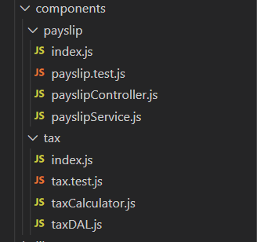

# Employee monthly pay slip

## Why built the solution the way
The solution is to develop small software: divide the whole application into self-contained components that each constitutes very few files (e.g. controller, service, data access, test, etc.)  

There are top 3 benefits that the solution brings
1. Keep the software complexity low
2. Improves maintainability. Each file is relatively small and so is easier to understand and change
3. Improves modularity. The separate modules are easier to test, implement or design.

## Design solution made
### Project Structure
The project structure is shown as per below.

```
src
│
└───components     
	|
	└───payslip   # Payslip calculation and format 
	│
	└───tax       # Tax data access and tax calculation
└───libs		  # Libraries
   	app.js        # App entry point
```

### Component layer
In each component, use the principle of SoC to layer the application.

Separate component code into layers: controller, services,and data access layer  



### Tax calculation solution
The tax rate list only has 5 tax rate level, so we can compare annual salary with each tax rate in the tax rate list to calculate tax at each rate level.
If salary is greater than the maximum income of the rate level, the tax at the rate level is (maximum income - start income) * rate.
If salary is less than the start income of the rate level, the tax at the rate level is 0.
If salary is between the start income and maximum income of the rate level, the tax at the rate level is (maximum income - start income) * rate.
Then we add the tax amount at each rate level up to get annual income tax.

## How to run code

1. install Node.js
2. Unzip payslip.zip file into a folder
3. Open a terminal or windows command and navigate to the directory where payslip is unzipped
4. Install application
```
npm install -g .
```
5. Run application

```
GenerateMonthlyPayslip "Mary Song" 60000
```

## How to run tests

1. Install testing framework Jest
```
npm install
```
2. Run test
```
npm run test
```

## Assumptions && trade-offs
  - Assumptions
     - The application needs to be run from command line from anywhere on user's system
     - The employee name must be entered
     - The annual salary must be entered and must not be negative
     - The gross monthly income and monthly income tax are rounding to 2 decimal places if necessary
 - Trade-offs
     - The project is using functional programming approach, so a few core concepts are applied such as using pure function and avoiding mutable data or states.